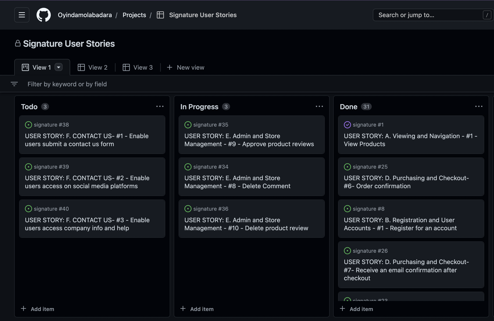

<h1 align="center">SIGNATURE</h1>

## **Table of Contents**

### **Live Site:**

[Click here to visit the live site.](https://signature.herokuapp.com/)

## **About**

The Signature website is a full-stack e-commerce project built for a fictional jewellery store. It is a B2C e-commerce website that provides role-based permissions for users to interact with a central dataset. It includes user authentication, email validation, and full CRUD functionality for approved users for Products, Categories, Blog Posts and Reviews. N.B. This project is for educational purposes only.

## **UX**

## **Purpose**

The site was designed with a seamless and simple-to-use interface that lets users to easily view and check the prices of the required jewellery, manage the items,  and get the order delivered to their doorsteps directly from the store. The blog and review section was created to enable users the opportunity to engage with the website.

## **User Stories**

[Click here](https://github.com/users/Oyindamolabadara/projects/3) to view the Kanban Board with the user stories.

[Back to top](#)