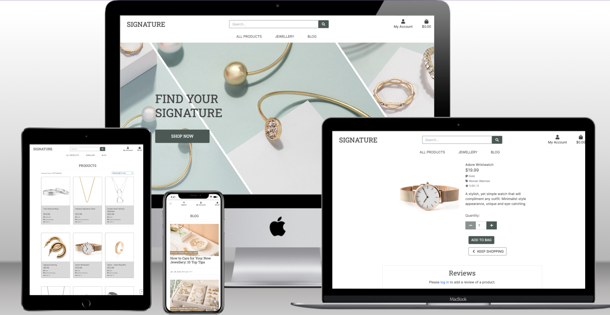

<h1 align="center">SIGNATURE</h1>

## **Table of Contents**

### **Live Site:**

[Click here to visit the live site.](https://signature.herokuapp.com/)

## **About**

The Signature website is a full-stack e-commerce project built for a fictional jewellery store. It is a B2C e-commerce website that provides role-based permissions for users to interact with a central dataset. It includes user authentication, email validation, and full CRUD functionality for approved users for Products, Categories, Blog Posts and Reviews. N.B. This project is for educational purposes only.

## **Wireframes**

* Wireframes were not created for confirmation pages, to avoid duplicating similar pages. 

* Due to time and deadline constraints, I had to take out the men's, collections; deals, clearance items and special offers categories from the site. 

[Back to top](#)

## **UX**

## **Purpose**

The site was designed with a seamless and simple-to-use interface that lets users to easily view and check the prices of the required jewellery, manage the items,  and get the order delivered to their doorsteps directly from the store. The blog and review section was created to enable users the opportunity to engage with the website.

## **User Stories**

[Click here](https://github.com/users/Oyindamolabadara/projects/3) to view the Kanban Board with the user stories.

### **Viewing and Navigation**

* As a shopper, I want to be able to view the site's blog and engage with the site’s content without necessarily having to make a purchase.
* As a shopper, I want to be able to view reviews of individual products by other shoppers so that I can make a better decision to purchase a product.
* As a shopper, I want to be able to easily view the total of my purchases at any point in time so that I can spend within my budget.
* As a shopper, I want to be able to view individual product details, so that I can identify the price, description, product rating, product image and available sizes and/or colours.
* As a shopper, I want to be able to view a specific category of products so that I can quickly find products I am interested in without having to search through all the products.
* As a shopper, I want to be able to view a list of products so that I can select some to purchase.
* As a shopper, I want to be able to easily contact the admin so that I can make enquiries, give feedback or get the necessary support needed.
* As a shopper, I want to be able to easily access social media platforms so that I can easily get information and updates.
* As a shopper, I want to be able to easily access company info and links for help and support.

### **Registration and User Accounts**

* As a site user, I want to be able to leave a review for an individual product I have purchased so that I can let other site users know what I think of something I have previously purchased.
* As a site user, I want to be able to leave a comment on a blog post so that I can engage with the site’s content without necessarily having to make a purchase.
* As a site user, I want to be able to have a personalised user profile so that I can view my order history and order confirmations and save my payment information.
* As a site user, I want to be able to receive an email confirmation after registering so that I can verify my account registration was successful.
* As a site user, I want to be able to easily recover my password in case I forget it so that I can recover access to my account.
* As a site user, I want to be able to easily log in or log out so that I can access my personal account information.
* As a site user, I want to be able to easily register for an account so that I can have a personal account and be able to view my profile.

### **Sorting and Searching**

* As a shopper, I want to be able to easily see what I’ve searched for and the number of results so that I can quickly decide if the product I want is available.
* As a shopper, I want to be able to search for a product by name or description so that I can find a specific product I’d like to purchase.
* As a shopper, I want to be able to sort multiple categories of products simultaneously so that I can find the best-priced or best-rated products across multiple categories.
* As a shopper, I want to be able to sort a specific category of products so that I can find the best-priced or best-rated product in a particular category, or sort the products in that category by name.
* As a shopper, I want to be able to sort the list of available products so that I can easily identify the best-rated, best-priced and categorically sorted products.

### **Purchasing and Checkout**

* As a shopper, I want to be able to receive an email confirmation after checkout so that I can keep the confirmation of what I’ve purchased for my records.
* As a shopper, I want to be able to view an order confirmation after checkout so that I can verify that I haven't made any mistakes.
* As a shopper, I want to be able to feel my personal and payment information is safe and secure so that I can confidently provide the required information to make a purchase. 
* As a shopper, I want to be able to easily enter my payment information so that I can conveniently checkout. 
* As a shopper, I want to be able to adjust the number of individual items in my bag so that I can easily make changes to my purchase before checkout.
* As a shopper, I want to be able to easily select the quantity of a product when purchasing it so that I can ensure I don’t accidentally select the wrong product or quantity.
* As a shopper, I want to be able to view items in my bag to be purchased so that I can identify the total cost of my purchase and all the items I will receive.

### **Admin and Store Management**

* As a site admin, I want to be able to delete product reviews so that I can remove product reviews that are irrelevant or unhelpful.
* As a site admin, I want to be able to approve product reviews so that I can remove comments that are spam or offensive.
* As a site admin, I want to be able to delete comments on my blog so that I can filter out any spam or irrelevant comments.
* As a site admin, I want to be able to approve comments on my blog so that I can filter out any spam or irrelevant comments.
* As a site admin, I want to be able to delete a blog post so that I can remove blog posts that are no longer relevant.
* As a site admin, I want to be able to edit/update a blog post so that I can change 
* As a site admin, I want to be able to write a blog post so that I can add new posts to my blog.
* As a site admin, I want to be able to delete a product so that I can remove items that are no longer for sale.
* As a site admin, I want to be able to edit and update products so that I can change product prices, descriptions, images and other product criteria.
* As a site admin, I want to be able to add a product so that I can add new items to my store.

[Back to top](#)

## **Web Marketing**

### **Newsletter**

A newsletter subscription was created using Mailchimp for email marketing. 

### **Facebook**

[A dummy Facebook page](https://www.facebook.com/profile.php?id=100089994846073) was set up as a means of social media marketing to interact with customers and promote products and services. 

I had to use Signature_unoffical as the page name because using "Signature" was invalid. 

## **Search Engine Optimization**

Based on my google search, the following relevant keywords were used for this project;
The Best Places To Find Jewellery, Engagement Rings, Jewellery Gifts, Quality Jewellery, Gifts for Her, Gifts for Women, Signature Jewellery, Jewellery shop near me, Jewellery Sale, Jewellery for Women, Gold Necklace, Gold Earrings, Silver Necklace, Silver Earrings

The site has been equipped with a sitemap generated [here](https://www.xml-sitemaps.com/) and robots.txt. 

The site also has a privacy policy generated [here](https://www.privacypolicygenerator.info/).

### **Structure**

The structure of this website was built using CI Boutique Ado Walkthrough Project, which contains the following apps; Home, Products, Profile, Bag and Checkout. The review, blog and company info app were created outside of the walkthrough project. 

### **Inspiration**

During the planning process, I went through a jewellery store, [Zudo](https://uk.zudo.co/) where I shop from. 
Asides the Boutique Ado Walkthrough, I also found two of CI’s students’ projects inspiring and helpful throughout the project; [Kat632’s Watch You Want?](https://github.com/Kat632/watchyouwant#readme) and [SamanthaBooth81’s clay_and_fire](https://github.com/SamanthaBooth81/clay_and_fire#readme)

### **Colour and Theme**

The theme for this website was inspired by the landing page image. The [Adobe Express free custom colour palette creator](https://color.adobe.com/create/image) was used to generate palettes with colour combinations used for the website. 

### **Font**

I choose the Inter and Roboto Slab fonts, as they both maintain great readability and are versatile. 

## **Technologies, Frameworks and Libraries Used**

* GitPod: was used as IDE to write the code and push it to GitHub.
* GitHub: was used for version control. 
* Git issues: was used for user stories. 
* Django: framework used in the development of the app. 
* Django Summernote: was used to embed Summernote into Django
* Django Crispy Forms: was used for rendering the behaviour of the forms. 
* Heroku: was used to deploy this project.
* PostgreSQL: was used as a database for this project.
* Bootstrap 4: was used for the design and structure of the app; grid, layout, columns, cards and forms structure.
* Stripe: was used for processing the online payment. 
* AWS S3 Bucket Storage: was for storing static files and media files.
* Font Awesome: used for all of the icons throughout the site.
* Mini Web Tool: to generate a new Django Secret Key.

## **Deployment**

See the following steps to deploy below:
* Log into Heroku and Create a New App.
* Give the App a name, it must be unique, and select a region closest to you.
* Click on 'Create App'. This will take you to a page where you can deploy your project.
* Next, click on the 'Resources' tab and search for 'Heroku Postgres' in the Add-ons section to add the Heroku Postgres database to the project.
* Click on the 'Settings' tab at the top of the page.
* Go to the section "Config Vars" and click the button "Reveal Config Vars".
* Add the variables below to the list. Here, the database URL is stored to run the app on Heroku. 
I generated a new Secret Key, to replace the insecure key that was in settings.py, then added the newly generated key to the Config Vars.
* Install Gunicorn, which will act as the web server and freeze that into the requirements file.
* Create Procfile in your app;
 	web: gunicorn PROJ_NAME.wsgi
* In the settings file, add Heroku to ALLOWED_HOSTS.
* Add and commit the changes in your code and push to github.
* Navigate to "Deploy" in the menu bar on the top.
* Go to section "deployment method" and choose "GitHub".
* New section "Connect to GitHub" will appear - Search for the repository to connect to.
* Type the name of your repository and click "search".
* Once Heroku finds your repository, click "connect".
* Scroll down to the section "Automatic Deploys".
* Click "Enable automatic deploys" or choose "Deploy branch" to manually deploy.
* Click "Deploy branch".
* Once the program runs, you should see the message "the app was successfully deployed".
* Click the button "View".

### **Getting Stripe keys**
From the stripe dashboard, navigate to the developers tab. On side menu you will find API keys. Copy STRIPE_PUBLIC_KEY and STRIPE_SECRET_KEY.
Go to Webhooks. Click Add Endpoint button in top right hand corner. Add endpoint URL (your local or deployed URL). Add all events then click on add endpoint You should be redirected to this webhook's page. Reveal webhook sign in secret and copy to Settings and to heroku as STRIPE_WH_SECRET variable.

### **Setting AWS Bucket**

* Go to Amazon Web Services page, then login or register.
* You should be redirected to AWS Managment Console, click Services icon and choose Console Home.
* Below the header AWS Services, click All Services and find S3 under Storage.
* Create New Bucket using Create Bucket button in top right hand corner.
    * Configuration: type in your chosen name for the bucket (preferably matching your heroku app name) and AWS Region closest to you.
    * Object ownership: ACLs enabled, Bucket owner prefered.
    * Block Public Access settings: Uncheck to allow public access, acknowledge that the current settings will result in the objects within the bucket becoming public.
    * Click Create Bucket.
* You should be redirected to Amazon S3 with list of your buckets. Click into the name of the bucket you just created.
* Find the tab Properties on the top of the page.
* Static website hosting at the bottom of the properties page: clik to edit, click enable, fill in index document: index.html and error.html for error
* On the Permissions tab:
    * Cross-origin resource sharing (CORS), paste in the below code as configuration and save;
    
        
            [
            {
                "AllowedHeaders": [
                    "Authorization"
                ],
                "AllowedMethods": [
                    "GET"
                ],
                "AllowedOrigins": [
                    "*"
                ],
                "ExposeHeaders": []
            }
            ]

* Go to the bucket policy tab and select policy generator to create a security policy for this bucket. The policy type is going to be s3 bucket policy and then allow all principals by using a '*' and the action will be, get object. Copy the ARN which stands for Amazon resource Name from the other tab and paste it into the ARN box at the bottom. Click 'Add statement' and then 'Generate Policy'.
* Copy this policy into the bucket policy editor, add '/*' at the end of the resource key to allow access to all resources in this bucket and then save it.
* Finally, to complete configuration, navigate to the 'access control list' tab, check edit, enable List for Everyone (public access) and accept the warning box.
* Create a group and a user to access the bucket by searching for the service IAM (Identify and Access Management). Click on 'User Groups' and then 'Create User Group'.
* Create the Policy used to access the bucket by clicking 'Policies' and then 'Create Policy'. Click onto the JSON tab and then select import managed policy to import one that AWS has pre-built for full access to s3.
* Search for s3 and then import the s3 full access policy. Get the bucket ARN from the bucket policy page in s3 and past that into the 'Resource' section on the JSON tab.
* Click the 'Next' buttons up until 'Review Policy', give it a name and a description and then click 'Create Policy'.
* Attach the policy to the created group by returning to the Create User Group page and refreshing the Policies box, attach the new policy created by selecting it and click 'Create Group'.
* Create a user to put in the group by going to the User's page and clicking 'Add User'. Create a user, give Programmatic Access, and click 'Create User'.
* Download the CSV file which contains the User's Access Key and Secret Access Key. It is important to download this file as it cannot be re-downloaded and contains the new user's credentials which will be added to the Config Vars on Heroku.
* Connect Django to the new S3 bucket. To do this, install two new packages; boto3 and django-storages.
* Freeze these to the requirements.txt file.
* To connect Django to S3 (only on Heroku), add the following in settings.py:

        if 'USE_AWS' in os.environ:
            # Cache control
            AWS_S3_OBJECT_PARAMETERS = {
                'Expires': 'Thu, 31 Dec 2099 20:00:00 GMT',
                'CacheControl': 'max-age=94608000',
            }

            # Bucket Config
            AWS_STORAGE_BUCKET_NAME = 'oyindamolabadara-signature'
            AWS_ACCESS_KEY_ID = os.environ.get('AWS_ACCESS_KEY_ID')
            AWS_SECRET_ACCESS_KEY = os.environ.get('AWS_SECRET_ACCESS_KEY')
            AWS_S3_CUSTOM_DOMAIN = f'{AWS_STORAGE_BUCKET_NAME}.s3.eu-west-2.amazonaws.com'

* Go to heroku to set up enviromental variables, open CSV file downloaded earlier and copy each variable into heroku settings; AWS_STORAGE_BUCKET_NAME,  AWS_ACCESS_KEY_ID and AWS_SECRET_ACCESS_KEY from csv, USE_AWS = True and remove DISABLE_COLLECTSTATIC variable from heroku.
* Create file in root directory custom_storages.py

        from django.conf import settings
        from storages.backends.s3boto3 import S3Boto3Storage

        class StaticStorage(S3Boto3Storage):
            location = settings.STATICFILES_LOCATION

        class MediaStorage(S3Boto3Storage):
            location = settings.MEDIAFILES_LOCATION

* Go to settings.py, add the AWS settings
        # Static and media files
        STATICFILES_STORAGE = 'custom_storages.StaticStorage'
        STATICFILES_LOCATION = 'static'
        DEFAULT_FILE_STORAGE = 'custom_storages.MediaStorage'
        MEDIAFILES_LOCATION = 'media'

        # Override static and media URLs in production
        STATIC_URL = f'https://{AWS_S3_CUSTOM_DOMAIN}/{STATICFILES_LOCATION}/'
        MEDIA_URL = f'https://{AWS_S3_CUSTOM_DOMAIN}/{MEDIAFILES_LOCATION}/'

* To load the media files to S3 bucket, go to the S3 bucket page on AWS, create new folder "media" and click upload. 

[Back to top](#)

## **Credits**

### **Resources**

* [Adobe Stock Images](https://stock.adobe.com/uk/)
* [ShutterStock Images](https://www.shutterstock.com/)
* [Pexels](https://www.pexels.com/)
* [Markdown best practices](https://www.markdownguide.org/basic-syntax/)
* [Markdown Table of content generator](http://ecotrust-canada.github.io/markdown-toc/)
* [Mockup generator](https://techsini.com/multi-mockup/index.php)
* [Balsamiq Wireframes](https://balsamiq.com/)
* [Privacy Policy](https://www.privacypolicygenerator.info/) 
* [Adobe Express](https://www.adobe.com/express/): was used to resize images and generate palettes with colour combinations used for the website. 
* The Blog Posts were taken from Joshua James Blog.
    * [First Blog Post](https://www.joshuajamesjewellery.co.uk/blog/how-to-take-care-of-your-engagement-ring/)
    * [Second Blog Post](https://www.joshuajamesjewellery.co.uk/blog/how-to-care-for-your-new-jewellery-our-top-tips/)

***

* The walkthrough project Boutique Ado from Code Institute - [original repo](https://github.com/Code-Institute-Solutions/boutique_ado_v1/tree/f5880efee43b3b9ea1276a09ca972f4588001c59). 
* I found two of CI’s students’ projects helpful throughout the project; [Kat632’s Watch You Want?](https://github.com/Kat632/watchyouwant#readme) and [SamanthaBooth81’s clay_and_fire](https://github.com/SamanthaBooth81/clay_and_fire#readme).
* Building the Django Contact Form with Email Backend: 
    * [Ordinary Coders](https://ordinarycoders.com/blog/article/build-a-django-contact-form-with-email-backend)
    * [Scottish Coder YouTube Tutorial](https://www.youtube.com/watch?v=1DcySa35fXw)

back to top button

responsiveness

grammarly

stripe testing

compress images

**Testing interactively**

When testing interactively, use a card number, such as 4242 4242 4242 4242. Enter the card number in the Dashboard or in any payment form.

    Use a valid future date, such as 12/34.
    Use any three-digit CVC (four digits for American Express cards).
    Use any value you like for other form fields. 

This information has been taken directly from the [Stripe testing documentation](https://stripe.com/docs/testing).

Please note that in order to enter a UK-based postcode, use a UK card number such as 4000 0582 6000 0005.

Compress images 

Bug: django secret key 
8. Following setting up the database I generated a new Secret Key, to replace the insecure key that was in settings.py and added: os.environ.get('SECRET_KEY'). I then added the newly generated key to the Config Vars on Heroku.

- [ ] CSS not loading on browser, even after hard refresh. I checked on the slack channel and found similar issues. It was solved by clearing my browser cache on chrome. 