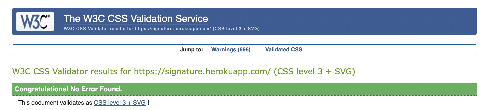

<h1 align="center">SIGNATURE TESTING FILE</h1>

### **Live Site:**

[Click here to visit the live site.](https://signature.herokuapp.com/)

### **Readme File:**
[Click here to visit the Readme File.](/README.md)

### **Testing Interactively:**

When testing interactively, use a card number, such as 4242 4242 4242 4242. Enter the card number in the Dashboard or in any payment form.

    Use a valid future date, such as 12/34.
    Use any three-digit CVC (four digits for American Express cards).
    Use any value you like for other form fields. 

This information has been taken directly from the [Stripe testing documentation](https://stripe.com/docs/testing).

Please note that in order to enter a UK-based postcode, use a UK card number such as 4000 0582 6000 0005.

## **Manual Testing**

| Manual Testing                        |                                                           |                                                                                                                                                                                           |      |   |
|---------------------------------------|-----------------------------------------------------------|-------------------------------------------------------------------------------------------------------------------------------------------------------------------------------------------|------|---|
|                                       |                                                           |                                                                                                                                                                                           |      |   |
| **Navigation**                            |                                                           |                                                                                                                                                                                           |      |   |
| **Reference**                             | **Test object**                                               | **Expected Result**                                                                                                                                                                           | **Pass** |   |
| **Navbar**                                |                                                           |                                                                                                                                                                                           |      |   |
|                                     1 | Store Logo/Home link                                      | Directs the user to the home page                                                                                                                                                         | PASS |   |
|                                     2 | Jewellery link                                           | Opens the jewellery dropdown menu. All jewellery links work                                                                                                                             | PASS |   |
|                                     3 | All Products link                                         | Opens the all products dropdown menu.  All links work                                                                                                                                     | PASS |   |
|                                     4 | Special Offers link                                       | Opens the special offers dropdown menu.  All the links work.                                                                                                                              | PASS |   |
|                                     5 | Blog Link                                                 | Directs the user to the 'Blog' page                                                                                                                                                       | PASS |   |
|                                     6 | Search bar                                                | Directs the user to the 'Products' page showing products that match the query                                                                                                             | PASS |   |
|                                     7 | My Account Icon                                           | Opens the account links dropdown menu                                                                                                                                                     | PASS |   |
|                                     8 | Sign in link (unsigned users)                             | Directs the 'Sign in' page                                                                                                                                                                | PASS |   |
|                                     9 | Sign up link (unsigned users)                             | Directs the 'Sign up' page                                                                                                                                                                | PASS |   |
|                                    10 | Sign out link (signed in users)                           | Directs the 'Sign out' page                                                                                                                                                               | PASS |   |
|                                    11 | My Profile (signed in users)                              | Directs the user to the profile page                                                                                                                                                      | PASS |   |
|                                    12 | Product management (superuser)                            | Directs the user to the 'Product management' page                                                                                                                                         | PASS |   |
|                                    13 | Bag Icon                                                  | Directs the user to their shopping cart page                                                                                                                                              | PASS |   |
|                                                                                                              
| **Footer**                                |                                                           |                                                                                                                                                                                           |      |   |
|                                     1 | Contact us link                                           | Directs the user to the 'Contact us' page                                                                                                                                                 | PASS |   |
|                                     2 | FAQ link                                   | Directs user to the FAQs page                                                                                                                                               | PASS |   |
|                                     3 | Privacy Policy link                                       | Directs user to the Privacy Policy page                                                                                                                                                   | PASS |   |
|                                                                                                                                                            4 | Shipping and returns                           | Direct the users to the Shipping and returns pages                                                                                                                                                 | PASS |   |
|                                     5 | Newsletter subscribe button                               | Displays the appropriate message INVALID/VALID                                                                                                                                            | PASS |   |
|                                     6 | Social media links                                        | Open the respective social network page in a new tab                                                                                                                                       | PASS |   |
| 7 | About Us links                                        | Directs users to the About Us page                   | PASS |   |                         
**Home Page**                             |                                                           |                                                                                                                                                                                           |      |   |
| **Reference**                             | **Test object**                                               | **Expected Result**                                                                                                                                                                           | Pass |   |
| 1                                     | Products by jewellery category links                                | Direct the user to the 'Products' page with the correct jewellery category filters in place                                                                                                         | PASS |   |
| **Products Page**                         |                                                           |                                                                                                                                                                                           |      |   |
| **Reference**                             | **Test object**                                               | **Expected Result**                                                                                                                                                                           | Pass |   |
|                                     1 | Product Count                                             | Product Count updates in accordance with the number of products displayed and search term displays if a user has entered a search query                                                   | PASS |   |
|                                     2 | View all products link                                    | Redirects to the 'Products' page showing the entire catalogue of products                                                                                                                 | PASS |   | 
|                                     3 | Sort By Dropdown                                          | Sort by dropdown displays all the options available and sorts the products in accordance with the selection                                                                               | PASS |   |
|                                     4 | Product Cards                                             | Clicking on a product card directs the user to the correct 'Product details' page                                                                                                         | PASS |   |
|                                     5 | Edit Product link (superuser)                             | Directs the superuser to the edit product form                                                                                                                                            | PASS |   |
|                                     6 | Delete Product link (superuser)                           | Triggers the delete confirmation modal                                                                                                                                                    | PASS |   |
| **Product Detail Page**                   |                                                           |                                                                                                                                                                                           |      |   |
| **Reference**                             | **Test object**                                               | **Expected Result**                                                                                                                                                                           | Pass |   |
| **Product Details**                       |                                                           |                                                                                                                                                                                           |      |   |
|                                     1 | Product Details                                           | Displays the detail of the appropriate product                                                                                                                                            | PASS |   ||                                                  
|                                     2 | Quantity selectors                                        | Allows the user to adjust the quantity by clicking the plus and minus icons.                                                                                                              | PASS |   |
|                                     3 | Add to bag link                                           | When a product is added to the bag, a toast to confirm the action is displayed, and the amount below the cart icon in the navbar is updated to reflect the price of the items in the cart | PASS |   |
|                                                                                                                            
| **Reviews**                               |                                                           |                                                                                                                                                                                           |      |   |
|                                     1 | Product Reviews                                           | Displays the reviews for the product                                                                                                                                                      | PASS |   |
|                                     2 | No Reviews message                                        | Displays when no reviews are present                                                                                                                                                      | PASS |   |
|                                     3 | Add review button                                         | Open the page to add a product review                                                                                                                                                     | PASS |   |
|                                     4 | Delete Comment link (reviewer)                            | Deletes the review                                                                                                                                                                        | PASS |   |
|                                     5 | Edit Comment link (reviewer)                              | Takes the user to the edit comment page                                                                                                                                                   | PASS |   |
| **Add a Review Page**                     |                                                           |                                                                                                                                                                                           |      |   |
| **Reference**                             | **Test object**                                               | **Expected Result**                                                                                                                                                                           | Pass |   |
|                                     1 | Add a review                                              | Allows user to post a review if all fields are valid, by clicking on the 'Submit' button.                                                                                                 | PASS |   |
| **Edit a Review Page**                    |                                                           |                                                                                                                                                                                           |      |   |
| **Reference**                             | **Test object**                                               | **Expected Result**                                                                                                                                                                           | Pass |   |
|                                     1 | Edit a review                                             | Allows a user to edit a review if all the fields are valid, by clicking the submit button.                                                                                                | PASS |   |
| **Shopping Bag page**                     |                                                           |                                                                                                                                                                                           |      |   |
| **Reference**                             | **Test object**                                               | **Expected Result**                                                                                                                                                                           | Pass |   |
|                                     1 | Quantity Selectors                                        | Allows the user to adjust the quantity by clicking the plus and minus icons. Limits the quantity to what items are in stock. Disallows minus numbers                                      | PASS |   |
|                                     2 | Update Link                                               | Updates the quantity for the selected product                                                                                                                                             | PASS |   |
|                                     3 | Remove Link                                               | Removes the selected product from the cart                                                                                                                                                | PASS |   |
|                                     4 | Price totals                                              | The subtotal of each product, cart total and grand total are updated whenever the cart's content is changed                                                                               | PASS |   |
|                                     5 | Delivery Cost                                             | Delivery cost is added or removed when cart total is above or below £50                                                                                                                   | PASS |   |
|                                     6 | Keep Shopping Button                                      | Redirects the user to the Products page                                                                                                                                                   | PASS |   |
|                                     7 | Secure Checkout Button                                    | Directs the user to the checkout page                                                                                                                                                     | PASS |   |
|                                     8 | Cart is empty message                                     | Displays when there are no products in the cart. Below 'Keep shopping' button is displayed and redirects the user to the Products page                                                    | PASS |   |
| Checkout page                         |                                                           |                                                                                                                                                                                           |      |   |
| **Reference**                             | **Test object**                                               | **Expected Result**                                                                                                                                                                           | Pass |   |
|                                     1 | Order Summary                                             | Order summary information renders correctly. Price totals match the contents of the bag                                                                                                   | PASS |   |
|                                     2 | Checkout Form                                             | Form only submits when all the required fields are filled                                                                                                                                 | PASS |   |
|                                     3 | Pre-populated fields                                      | When a user is signed in and their shipping details have been saved on their profile, the corresponding fields are pre-populated                                                          | PASS |   |
|                                     4 | Save details checkbox                                     | When the delivery information checkbox is checked the user's profile is updated with the correct information after the form submission                                                    | PASS |   |
|                                     5 | Log In and Sign Up Links (unsigned users)                 | The sign in and sign up links are displayed and redirected the user to the relevant page                                                                                                  | PASS |   |
|                                     6 | Card errors                                               | Card errors message displays in case of: invalid card number, insufficient funds, etc.                                                                                                    | PASS |   |
|                                     7 | Card Charge notification                                  | Is displayed to let the user know how much their card will be charged to verify that the figure matches the total in the order summary section                                            | PASS |   |
|                                     8 | Adjust Cart button                                        | Redirects the user to the shopping cart                                                                                                                                                   | PASS |   |
|                                     9 | Complete Order button                                     | Triggers the loading overlay before redirecting the user to the Checkout Success page                                                                                                     | PASS |   |
| **Checkout success page and Stripe**      |                                                           |                                                                                                                                                                                           |      |   |
| **Reference**                             | **Test object**                                               | **Expected Result**                                                                                                                                                                           | Pass |   |
|                                     1 | Toast success message                                     | When the user is redirected to the Checkout Success page, a confirmation toast with the order number and a message to let the user know a confirmation email has been sent is displayed   | PASS |   |
|                                     2 | Confirmation Email                                        | The user receives a confirmation email to the address entered on the checkout page                                                                                                        | PASS |   |
|                                     3 | Order Summary                                             | Renders correctly with a list of the purchased products                                                                                                                                   | PASS |   |
|                                     4 | Order and Billing Info                                    | Matches the information entered on the checkout form and displays correct totals                                                                                                          | PASS |   |
|                                     5 | Continue Shopping link                                    | Redirects the user to the Products page                                                                                                                                                   | PASS |   |
|                                     6 | Back to profile link (if user accessed page from Profile) | Displays when users are looking at past orders from their profile, and when clicked it redirects the user back to the Profile page                                                        | PASS |   |
|                                     7 | Stripe payment succeed webhook                            | If payment succeeds, Stripe shows webhook: payment_intent.succeeded with status 200                                                                                                       | PASS |   |
|                                     8 | Order confirmation email                                  | If payment succeeds, the user receives a confirmation email with the order details                                                                                                        | PASS |   |
| **Contact Page**                          |                                                           |                                                                                                                                                                                           |      |   |
| **Reference**                             | **Test object**                                               | **Expected Result**                                                                                                                                                                           | Pass |   |
| 1                                     | Form Validation                                           | The form cannot be submitted without all the required fields being filled                                                                                                                 | PASS |   |
|                                     2 | Submit Button                                             | Once clicked the form is cleared and a success message displays to inform the user that their message has been sent                                                                       | PASS |   |
| **Blog Page**                             |                                                           |                                                                                                                                                                                           |      |   |
| **Reference**                             | **Test object**                                               | **Expected Result**                                                                                                                                                                           | Pass |   |
|                                     1 | Blog Post links                                           | Direct the user to the correct 'Blog Post' page                                                                                                                                           | PASS |   |
| **Blog Post Page**                        |                                                           |                                                                                                                                                                                           |      |   |
| **Reference**                             | **Test object**                                               | **Expected Result**                                                                                                                                                                           | Pass |   |
|                                     1 | Log In and Sign Up Links (unsigned users)                 | Log In and Sign Up Links (unsigned users)                                                                                                                                                 | PASS |   |
|                                     2 | Log In and Sign Up Links (unsigned users)                 | Displays when no comments are present                                                                                                                                                     | PASS |   |
|                                     3 | Add comment button                                        | Open the post comment modal                                                                                                                                                               | PASS |   |
|                                     4 | Post Comment form                                         | Allows user to post a comment, given that all the required field on the form are filed, by clicking on the 'Submit' button                                                                | PASS |   |
| **Profile Page**                          |                                                           |                                                                                                                                                                                           |      |   |
| **Reference**                             | **Test object**                                               | **Expected Result**                                                                                                                                                                           | Pass |   |
|                                     1 | Delivery Information Form                                 | User's shipping information is displaying in the relevant fields if they have previously made an order and clicked the save to profile checkbox                                           | PASS |   |
|                                     2 | Update Information button                                 | Saves changes to the user's profile if form is valid and a success message displays to confirm this to the user                                                                           | PASS |   |
|                                     3 | Previous orders                                           | Displays in the order history section with the latest order at the top                                                                                                                    | PASS |   |
|                                     4 | Previous order confirmation                               | Clicking the order number takes the user to the checkout success page for the selected order                                                                                              | PASS |   |
| **Add Product (Product Management) Page** |                                                           |                                                                                                                                                                                           |      |   |
| **Reference**                             | **Test object**                                               | **Expected Result**                                                                                                                                                                           | Pass |   |
|                                     1 | Required Fields                                           | Form does not submit unless required fields are correctly filled                                                                                                                          | PASS |   |
|                                     2 | Dropdown Fields                                           | All the categories options appear in the dropdown fields                                                                                                                                  | PASS |   |
|                                     3 | Select Image Link                                         | Allows the user to upload an image from their device, and a message displays to the user the images' name                                                                                 | PASS |   |
|                                     4 | Cancel Button                                             | Redirects the user back to the products page                                                                                                                                              | PASS |   |
|                                     5 | Add Product Button                                        | Redirects the user to the 'Product details' page for the new product with the correct information displayed                                                                               | PASS |   |
| **Edit Product Page**                     |                                                           |                                                                                                                                                                                           |      |   |
| **Reference**                             | **Test object**                                               | **Expected Result**                                                                                                                                                                           | Pass |   |
|                                     1 | Form Fields                                               | Form fields are pre-populated with the product information stored in the database                                                                                                         | PASS |   |
|                                     2 | Cancel Button                                             | Redirects the user back to the 'Products' page                                                                                                                                            | PASS |   |
|                                     3 | Update Product Button                                     | Updates any of the product information and redirects the user to the 'Product details' page for the edited product with the correct information displayed                                 | PASS |   |
| Backend Blog post pages               |                                                           |                                                                                                                                                                                           |      |   |
| **Reference**                             | **Test object**                                               | **Expected Result**                                                                                                                                                                           | Pass |   |
|                                     1 | Add blog post                                             | Superuser can add a blog post                                                                                                                                                             | PASS |   |
|                                     2 | Edit blog post                                            | Superuser can edit a blog post                                                                                                                                                            | PASS |   |
|                                     3 | Delete blog post                                          | Superuser can delete a blog post                                                                                                                                                          | PASS |   |
|                                     4 | Approve comments                                          | Superuser can approve blog post comments                                                                                                                                                  | PASS |   |
|                                     5 | Delete comments                                           | Superuser can delete comments                                                                                                                                                             | PASS |   |
| **Backend Reviews**                       |                                                           |                                                                                                                                                                                           |      |   |
| **Reference**                             | **Test object**                                               | **Expected Result**                                                                                                                                                                           | Pass |   |
|                                     1 | Delete a review                                           | Superuser can delete a review                                                                                                                                                             | PASS |   |
| **Sign In**                               |                                                           |                                                                                                                                                                                           |      |   |
| **Reference**                             | **Test object**                                               | **Expected Result**                                                                                                                                                                           | Pass |   |
|                                     1 | Sign Up Link                                              | Directs the user to the sign up page                                                                                                                                                      | PASS |   |
|                                     2 | Home Link                                                 | Directs the user to the home page                                                                                                                                                         | PASS |   |
|                                     3 | Forgot Password Link                                      | Directs the user to the Password Reset page                                                                                                                                               | PASS |   |
|                                     4 | Sign In Link                                              | If the details are correct the user is redirected to the home page                                                                                                                        | PASS |   |
| **Sign Out**                              |                                                           |                                                                                                                                                                                           |      |   |
| **Reference**                             | **Test object**                                               | **Expected Result**                                                                                                                                                                           | Pass |   |
| 1                                     | Sign Out button                                           | Signs the user out of their account and redirects to the home page                                                                                                                        | PASS |   |
| **Sign Up**                               |                                                           |                                                                                                                                                                                           |      |   |
| **Reference**                             | **Test object**                                               | **Expected Result**                                                                                                                                                                           | Pass |   |
|                                     1 | Sign In Link                                              | Directs the user to the sign in page                                                                                                                                                      | PASS |   |
|                                     2 | Back to Login Link                                        | Redirects the user to the sign in page                                                                                                                                                    | PASS |   |
|                                     3 | Sign Up Link                                              | If the form is valid directs the user to the verify email address page and a confirmation email is sent to the user                                                                       | PASS |   |

[Back to top](#)

## **Automated Testing**

***

### **Lighthouse**

Lighthouse

### **Code Validation**
The [W3C Markup Validator](https://validator.w3.org/ "Link to W3C Markup Validator Site") service was used to validate the `HTML` and `CSS` code used. The [PEP8 Python Validator](http://pep8online.com/ "Link to the PEP8 Python Validator Site") was used to validate the `Python` code used. The [JSHint JavaScript Validator](https://jshint.com/ "Link to the JSHint JavaScript Validator Site") was used to validate the `JavaScript` code used.

#### **Results:**

#### **HTML Pages**

HTML Validation Errors

HTML Validation

#### **CSS Stylesheets**

CSS Validation

### **JavaScript Files**

JavaScript Files - JS Validation

bag.html

base.html

countryfield.js

quantity_input_script.js

### **Python Files**
The python files were validated using Pep8 Online. However, I was unable to attach their images due to time constraints. 

### **Responsive Testing**
I have tested this project's responsiveness across multiple devices and screen sizes using Google developer tools.

### **Bugs**

* My app kept on crashing during my initial deployment to Heroku with the error message; "NameError: name 'application' is not defined". After having another pair of eyes to help go through it, I noticed that I missed out on making 'signature.herokuapp.com' a string in allowed host in settings.py.
* CSS was not loading on browser, even after hard refresh. I checked on the slack channel and found similar issues. It was solved by clearing my browser cache on chrome. 
* During the process of creating the contact us form, when trying to send a message through Gmail with my app, I got the error message; OSError: [Errno 101] Network is unreachable. I tried testing getting the emails using the terminal, which worked fine. In the tutorial I used, I was instructed to change settings to allow Gmail to use less secure apps. I found out that the setting is no longer available on google. Google updated their security such that there are port restrictions and emails don't work on GitPod anymore.
* The Django-Summernote editor was not showing in the Admin panel for my content/body, thus I was unable to add any review or comment to the body. In the console, I got the Uncaught Type Error; Cannot read properties of undefined (reading 'summernote'). I figured that the issue was with the iframe in the settings file. It was set to False. When I changed it to True, it worked fine and I was able to use the editor.
* Another deployment issue was a ProgrammingError; at /blog/ relation "products_product" does not exist. I had to reset the database entirely from the Elephant SQL dashboard and delete all migration files. I created an env.py file to contain the config var variables, then reloaded the data to the database.

    I had to update the DATABASE_URL on my Heroku Config Vars, then got another error from Heroku; cannot overwrite attachment values DATABASE_URL. I was told that I will not be able to remove the DATABASE_URL Heroku config var while I have a Heroku Postgres addon. I temporarily removed the Heroku Postgres addon to update the DATABASE_URL.
* The secret key had been previously exposed but was recovered and a new one was generated.

